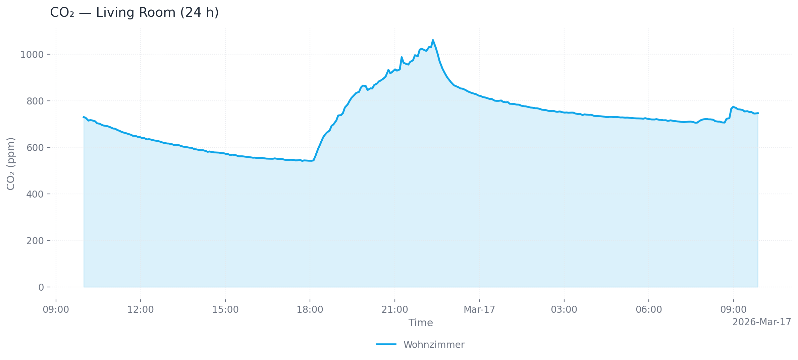
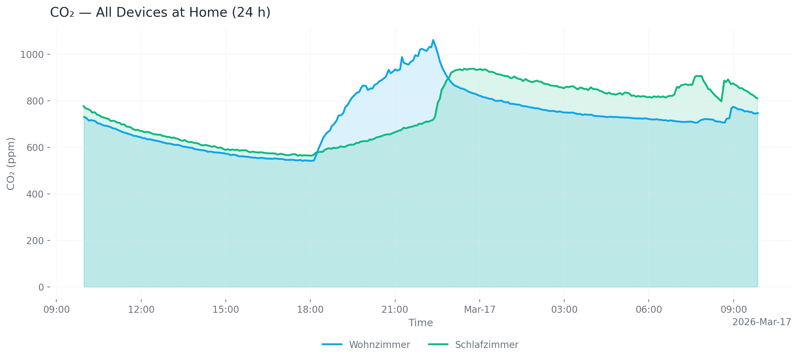

# mcp-airq-cloud


[](https://pypi.org/project/mcp-airq-cloud/)
[](https://pepy.tech/project/mcp-airq-cloud)
[](https://pypi.org/project/mcp-airq-cloud/)
[](LICENSE)
[](https://github.com/CorantGmbH/mcp-airq-cloud/actions/workflows/tests.yml)
[](https://codecov.io/gh/CorantGmbH/mcp-airq-cloud)

MCP server for the [air-Q](https://www.air-q.com) Cloud API — access air quality data from anywhere.

Unlike [mcp-airq](https://github.com/CorantGmbH/mcp-airq) (which communicates directly with devices on the local network), this server uses the **air-Q Cloud REST API** to retrieve sensor data remotely.

The same `mcp-airq-cloud` executable also works as a direct CLI when you pass a
tool name as a subcommand.

<!-- mcp-name: io.github.CorantGmbH/mcp-airq-cloud -->

## Tools

| Tool | Description |
|------|-------------|
| `list_devices` | List configured air-Q Cloud devices |
| `get_air_quality` | Get latest sensor readings (supports device/location/group selection) |
| `get_air_quality_history` | Get historical data within a time range as column-oriented JSON |
| `plot_air_quality_history` | Render one historical chart per sensor across all matching devices |
| `export_air_quality_history` | Export one historical sensor as one `csv` or `xlsx` across matching devices |

All tools are **read-only** — the Cloud API does not support device configuration or control.

## Installation

```bash
pip install mcp-airq-cloud
```

Or install from source:

```bash
git clone https://github.com/CorantGmbH/mcp-airq-cloud.git
cd mcp-airq-cloud
uv sync --frozen --extra dev
```

## CLI Usage

Use the same command directly from the shell:

```bash
mcp-airq-cloud list-devices
mcp-airq-cloud get-air-quality --device "Living Room"
mcp-airq-cloud get-air-quality-history --device "Living Room" --last-hours 24 --sensors co2 pm2_5
mcp-airq-cloud plot-air-quality-history --sensor co2 --output-format png --output co2.png
mcp-airq-cloud export-air-quality-history --sensor co2 --output-format xlsx --output co2.xlsx
```

For historical plots and exports:
- omit `device`, `location`, and `group` to combine all configured devices into one artifact
- use `location` or `group` to combine only the matching devices
- `plot_air_quality_history` returns one file per requested sensor, with one series per matching device
- `export_air_quality_history` returns one CSV/XLSX file per request, with rows for all matching devices

The CLI subcommands mirror the MCP tool names. Both styles work:

```bash
mcp-airq-cloud list-devices
mcp-airq-cloud list_devices
```

To force MCP server mode from an interactive terminal, run:

```bash
mcp-airq-cloud serve
```

The CLI is pipe-friendly: successful command output goes to `stdout`, while
tool errors go to `stderr` with exit code `1`. Plot commands can also stream
directly to `stdout`.

```bash
mcp-airq-cloud get-air-quality --device "Living Room" | jq '.co2'
mcp-airq-cloud get-air-quality-history --device "Living Room" --compact-json | jq '.columns.co2'
mcp-airq-cloud get-air-quality-history --device "Living Room" --yaml | yq '.columns.co2'
mcp-airq-cloud plot-air-quality-history --sensor co2 --device "Living Room" --output - > co2.png
mcp-airq-cloud export-air-quality-history --sensor co2 --device "Living Room" --output - > co2.xlsx
```

## Historical Data

Three tools provide access to historical sensor data via the air-Q Cloud API:

### Plotting charts

`plot_air_quality_history` renders a chart for one sensor. When multiple devices
match, each device becomes a separate series in the same chart.



*Single device (24 h, area chart, PNG)*



*Multiple devices at one location (24 h, area chart, PNG)*

```bash
# Single device, last 24 hours (default), PNG output (default)
mcp-airq-cloud plot-air-quality-history --sensor co2 --device "Living Room"

# All devices at a location, custom time range, SVG output
mcp-airq-cloud plot-air-quality-history --sensor co2 --location "Living Room" \
  --from-datetime "2026-03-16T00:00:00" --to-datetime "2026-03-17T00:00:00" \
  --output-format svg --output co2.svg

# All configured devices, dark mode, line chart
mcp-airq-cloud plot-air-quality-history --sensor co2 --dark --chart-type line

# Save to file
mcp-airq-cloud plot-air-quality-history --sensor co2 --output co2_chart.png
```

**Output formats:** `png` (default), `webp`, `svg`, `html` (interactive Plotly chart with hover tooltips and zoom)

**Customization:** `--title`, `--x-axis-title`, `--y-axis-title`, `--chart-type` (line/area), `--dark`, `--timezone-name`

### Exporting data

`export_air_quality_history` produces one CSV or Excel file containing all matching devices.

```bash
# CSV export (default)
mcp-airq-cloud export-air-quality-history --sensor co2 --device "Living Room" --last-hours 48

# Excel export for all devices at a location
mcp-airq-cloud export-air-quality-history --sensor co2 --location "Home" \
  --output-format xlsx --output co2.xlsx
```

### Common parameters

| Parameter | Default | Description |
|-----------|---------|-------------|
| `--last-hours` | 1 (history) / 24 (plot) | Hours of data to retrieve |
| `--from-datetime` / `--to-datetime` | — | ISO 8601 time range (overrides `--last-hours`) |
| `--max-points` | 300 | Downsample to at most N evenly spaced points |
| `--timezone-name` | UTC | IANA timezone for timestamps (e.g. `Europe/Berlin`) |

## Configuration

You need a **Cloud API key** and the **32-character device ID** for each device. Both can be obtained at [my.air-q.com](https://my.air-q.com).

### Option 1: Environment variable (inline JSON)

```bash
export AIRQ_CLOUD_DEVICES='[{"id": "de45d2ed777780c96c0deae7a220b745", "api_key": "your-api-key", "name": "Living Room"}]'
```

### Option 2: Default config file (recommended)

Place a JSON file at `~/.config/airq-cloud-devices.json` — no environment variable needed:

```json
[
  {"id": "de45d2ed777780c96c0deae7a220b745", "api_key": "your-api-key", "name": "Living Room"}
]
```

### Option 3: Custom config file path

```bash
export AIRQ_CLOUD_CONFIG_FILE=/path/to/devices.json
```

### Option 4: Global API key

If all devices share the same API key, set it once:

```bash
export AIRQ_CLOUD_API_KEY="your-api-key"
export AIRQ_CLOUD_DEVICES='[{"id": "de45d2ed777780c96c0deae7a220b745", "name": "Living Room"}]'
```

### Device config fields

| Field | Required | Description |
|-------|----------|-------------|
| `id` | yes | 32-character cloud device ID |
| `api_key` | no | Per-device API key (falls back to `AIRQ_CLOUD_API_KEY`) |
| `name` | no | Friendly name (defaults to first 8 chars of ID) |
| `location` | no | Location for grouping (e.g. "Wohnzimmer") |
| `group` | no | Group for grouping (e.g. "zu Hause") |

## Usage with Claude Desktop

Add to `claude_desktop_config.json`:

```json
{
  "mcpServers": {
    "air-Q Cloud": {
      "command": "mcp-airq-cloud",
      "env": {
        "AIRQ_CLOUD_DEVICES": "[{\"id\": \"<device-id>\", \"api_key\": \"<key>\", \"name\": \"Living Room\"}]"
      }
    }
  }
}
```

## Usage with Claude Code

```bash
claude mcp add air-Q-Cloud mcp-airq-cloud \
  -e AIRQ_CLOUD_DEVICES='[{"id":"<ID>","api_key":"<KEY>","name":"<Name>"}]'
```

## Development

```bash
uv sync --frozen --extra dev
uv run pre-commit install
uv run pytest
```

The repository uses a project-local `.venv` plus `uv.lock` for reproducible
tooling. Run developer commands through `uv run`, for example:

```bash
uv run ruff check .
uv run ruff format --check .
uv run pyright
uv run pre-commit run --all-files
```

## License

Apache 2.0 — see [LICENSE](LICENSE).
